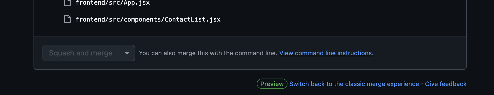

<h1 align="center">
  <br>
  <a href="#"></a>
</h1>

<h4 align="center"><i>A sleek progress tracker for resilient job hunters </i>🏋🏽</h4>

<p align="center">
    <a href="https://github.com/Resilient-Labs/Sprint3-HitlistCohort/commits/master">
    
    <a href="https://github.com/Resilient-Labs/Sprint3-HitlistCohort/issues">
    
    <a href="https://github.com/Resilient-Labs/Sprint3-HitlistCohort/pulls">
    
</p>
      
<p align="center">
  <a href="#features">Features</a> •
  <a href="#installation">Installation</a> •
  <a href="#updating">Updating</a> •
  <a href="#APIs">APIs</a> •
  <a href="#contributing">Contributing</a> •
  <a href="#credits">Credits</a> •
  <a href="#license">License</a>
</p>


<h2 id="features">Features</h2>

* Users can signup and login to their accounts
* Companies can be created using a form on the home page 
* A user can search all saved companies by company name, location, role, etc. 

<h2 id="installation">Installation</h2>

<h3>Getting Started</h3>

This app is a monorepo that houses both the frontend and backend of Hitlist Pro. To get the app running you will need to run the backend and frontend independantly. There are some pre-requisites for this project: 

<label class="container">
  <input type="checkbox">
  Node.js (at least version 18 or higher)
  <span class="checkmark"></span>
</label>

<label class="container">
  <input type="checkbox">
  Vite
  <span class="checkmark"></span>
</label>

<label class="container">
  <input type="checkbox">
  NVM (this is optional, but will be helpful. You can also use NPM)
  <span class="checkmark"></span>
</label>

<h3> Running the frontend </h3>

1. Clone the repository onto your machine. 

2. Navigate to ``` ./frontend ```.

3. Run ```npm install ```. If you have an issue downloading the project dependencies, you may have an outdated node version.  If you are using nvm, run ``` nvm use 18.18.0 ```. The required version of the project may change. Check the terminal to determine which version nvm should use. 

4. Run ``` npm run dev ```. This will start the frontend. 

5. Navigate to ``` http://localhost:5174/ ```


To run the front end from the backend folder: 

1. In frontend folder: ```npm run build``` first to create minimized dist directory

2. In frontend folder: ```cp -r dist ../backend``` to copy minimized dist folder from the frontend into backend

3. Still In the frontend folder: ```npm run dev```

4. Then in the backend folder run ```npm run dev```


<h3> Running the backend </h3>

1. Run ```npm i```. If you are using nvm make sure to run ```npm use [required  node version for project]```

2. Navigate to ```./backend```

3. Run ```npm run start```

4. Ensure the backend is at ```http://localhost:3001/```

<br/>

<h3> 

<h2 id="updating">Updating</h2>

<h3>Workspaces</h3>

This project used workspaces to manage dependencies within its monorepo.  You can read more about how workspaces work <a href="https://docs.npmjs.com/cli/v7/using-npm/workspaces?v=true">here</a> in NPM's documentation. The active workspaces in this project are listed within  ```./package.json``` and ```./package-lock.json```. 

To create a new workspace you can run ```npm init -w [the path of your workspace]```. I do not reccommend updating these files manually since a typo could really ruin your day and introduce bugs. 

<br/>

<h2 id="contributing">Contributing</h2>

<h3>PR Templates</h3>

When you are creating a PR for the project, make sure to fill out the PR template. The template exist within the ./github folder at the root of the project. If you make changes to this template, like all other changes, be sure to create a Pull Request. For more information on the reasoning behind PR templates, see <a href="https://github.com/pieterherman-dev/PR-Template-Guide/blob/main/README.md">This PR Template guide</a> or checkout github's documentation. All PRs should be comparing the main branch to your feature branch. Here is an example of a PR description using the template: <a href="https://github.com/Resilient-Labs/Sprint3-HitlistCohort/pull/31">Documentation Initial Readme</a>

<h3>To Squash or Not To Squash</h3>

Squash. After your PR is approved by our DEV OPs lead, you will want to <u>squash merge</u> your changes. Your commit history leading up to your PR is not needed for posterity. If you don't squash then this history will end up on the main branch. Feel free to keep that record on your machine or on that specific branch.

So how and why do I squash merge my changes? 

Squash merging is usually an option listed below a PR after it is approved.



That button gives github permission to Squash the git history associated with the feature branch that you are tying to merge into main.

That way the commit history under your feature branch is mot merged into the history of the main branch which can kind of clutter the project’s full history over time. See [HitList Pro Commit History]('https://github.com/Resilient-Labs/Sprint3-HitlistCohort/commits/main/'). 

If every developer who pushed the changes to the main branch retained their commit history, this page would grow exponentially over time. This would make it more difficult to pin down specific feature changes and would add possibly unnecessary commits to our git history. A pro on the other hand is that the project would retain a high level of detail about all the commits that have made up the project. There are pros and cons to squashing. 

If you want to squash merge without github, you can do a git squash locally before or after your PR is approved. After you squash (and rebase if you need to). Then push your changes and merger them to main.
Here is an article that explains more about git squash and how to use it: [Free code camp article on squash commits]('https://www.freecodecamp.org/news/git-squash-commits/')

<br/>

<h2 id="APIs">APIs</h2>

<h4>Usage</h4> Connect to the API using Postman or Insominia. The API lives at <code>http://localhost:3001</code> when the server is running. 

<h4>Technologies used</h4

* [NodeJS](https://nodejs.org/) This is a cross-platform runtime environment built on Chrome's V8 JavaScript engine used in running JavaScript codes on the server. It allows for installation and managing of dependencies and communication with databases.
* [ExpressJS](https://www.expresjs.org/) This is a NodeJS web application framework.
* [MongoDB](https://www.mongodb.com/) This is a free open source NOSQL document database with scalability and flexibility. Data are stored in flexible JSON-like documents.
* [Mongoose ODM](https://mongoosejs.com/) This makes it easy to write MongoDB validation by providing a straight-forward, schema-based solution to model to application data.

<h4>Requests and Responses</h4>

<details>
<summary><strong><code>GET: /signup</code></strong> - Action: To create an account for the user.</summary>

<div style='border-radius: 8px; background-color: grey; padding:8px;'>

| Status | Response |
|--------|----------|
| <div style="padding: 8px; color: white; background-color: green; border-radius: 6px; width: 40px; text-align: center;"><strong>201</strong></div> | <code>{ "user": {}, "message": "User registered successfully", "token": "string" }</code> |
| <div style="padding: 8px; color: white; background-color: orange; border-radius: 6px; width: 40px; text-align: center;"><strong>400</strong></div> | <code>{ "message": "Email already in use" }</code> |
| <div style="padding: 8px; color: white; background-color: red; border-radius: 6px; width: 40px; text-align: center;"><strong>500</strong></div> | <code>{ "message": "Server error", "error": "string" }</code> |

</div>
</details>

<details>
<summary><strong><code>GET: /login</code></strong> - Action: To sign the user into the app.</summary>

<div style='border-radius: 8px; background-color: grey; padding:8px;'>

| Status | Response |
|--------|----------|
| <div style="padding: 8px; color: white; background-color: green; border-radius: 6px; width: 40px; text-align: center;"><strong>200</strong></div> | <code>{ "message": "Login successful", "token": "string", "user": {} }</code> |
| <div style="padding: 8px; color: white; background-color: orange; border-radius: 6px; width: 40px; text-align: center;"><strong>400</strong></div> | <code>{ "message": "Invalid email or password" }</code> |
| <div style="padding: 8px; color: white; background-color: red; border-radius: 6px; width: 40px; text-align: center;"><strong>500</strong></div> | <code>{ "message": "Server error", "error": "string" }</code> |

</div>
</details>

<details>
<summary><strong><code>GET: /companies</code></strong> - Action: To retrieve a list of companies and applications saved by the user.</summary>

<div style='border-radius: 8px; background-color: grey; padding:8px;'>

| Status | Response |
|--------|----------|
| <div style="padding: 8px; color: white; background-color: green; border-radius: 6px; width: 40px; text-align: center;"><strong>200</strong></div> | <code>{ "companies": [{ "name": "string", "status": "string", "applicationUrl": "string", "notes": "string", "pointOfContacts": ["string"] }] }</code> |
| <div style="padding: 8px; color: white; background-color: red; border-radius: 6px; width: 40px; text-align: center;"><strong>500</strong></div> | <code>{ "error": "Internal Server Error" }</code> |

</div>
</details>

<details>
<summary><strong><code>PUT: /companies/:id</code></strong> - Action: To update the details of an existing company.</summary>

<div style='border-radius: 8px; background-color: grey; padding:16px;'>

<span>Request Params: <code>{ "id": "string" }</code></span>

| Status | Response |
|--------|----------|
| <div style="padding: 8px; color: white; background-color: green; border-radius: 6px; width: 40px; text-align: center;"><strong>200</strong></div> | <code>{ "companies": [{ "name": "string", "status": "string", "applicationUrl": "string", "notes": "string", "pointOfContacts": ["string"] }] }</code> |
| <div style="padding: 8px; color: white; background-color: red; border-radius: 6px; width: 40px; text-align: center;"><strong>500</strong></div> | <code>{ "error": "Internal Server Error" }</code> |

</div>
</details>

<details>
<summary><strong><code>GET: /all-contacts</code></strong> - Action: To retrieve an array of all the user's contacts.</summary>

<div style='border-radius: 8px; background-color: grey; padding:16px;'>

| Status | Response |
|--------|----------|
| <div style="padding: 8px; color: white; background-color: green; border-radius: 6px; width: 40px; text-align: center;"><strong>200</strong></div> | <code>{ "allContacts": ["string"] }</code> |
| <div style="padding: 8px; color: white; background-color: red; border-radius: 6px; width: 40px; text-align: center;"><strong>500</strong></div> | <code>{ "error": "Internal Server Error" }</code> |

</div>
</details>

<h2> Schemas <h2>

### Contact Schema (`backend/models/contact.schema.js`)

```javascript
const mongoose = require('mongoose');

const contactSchema = new mongoose.Schema({
  role: String,
  email: String,
  linkedIn: String,
  company: String,  // Deprecated: This is being replaced by the reference to Company model below.
  company: {
    type: mongoose.Schema.Types.ObjectId,
    ref: 'Company'  // References the 'Company' model, establishing a relationship between Contact and Company
  },
  lastContactDate: Date,
});

const ContactModel = mongoose.model('Contact', contactSchema);

module.exports = ContactModel;
```
<h3>Contact Schema Fields</h3>
    <ul>
        <li><strong>role:</strong> The role of the contact (e.g., Manager, Developer).</li>
        <li><strong>email:</strong> The contact's email address.</li>
        <li><strong>linkedIn:</strong> The contact's LinkedIn profile.</li>
        <li><strong>company:</strong> Deprecated. Previously used as a string field, now replaced with an ObjectId reference to the Company model.</li>
        <li><strong>company:</strong> The ObjectId referencing a company document from the Company model. This creates a relationship between the Contact and Company models.</li>
        <li><strong>lastContactDate:</strong> The most recent date when the contact was interacted with.</li>
    </ul>

### Company Schema (`backend/models/company.schema.js`)

```javascript

const mongoose = require('mongoose');

const companySchema = new mongoose.Schema({
  name: String,
  status: String,
  applicationUrl: String,
  notes: String,
  pointOfContacts: [String], // Deprecated: This is replaced by a reference to the Contact model below.
  pointOfContacts: [{
    type: mongoose.Schema.Types.ObjectId,
    ref: 'Contact'  // References the 'Contact' model, establishing a relationship between Company and Contact
  }],
});

const CompanyModel = mongoose.model('Company', companySchema);

module.exports = CompanyModel;
```
<h3>Contact Schema Fields</h3>
   <ul>
        <li><strong>role:</strong> The role of the contact (e.g., Manager, Developer).</li>
        <li><strong>email:</strong> The contact's email address.</li>
        <li><strong>linkedIn:</strong> The contact's LinkedIn profile.</li>
        <li><strong>company:</strong> Deprecated. Previously used as a string field, now replaced with an ObjectId reference to the Company model.</li>
        <li><strong>company:</strong> The ObjectId referencing a company document from the Company model. This creates a relationship between the Contact and Company models.</li>
        <li><strong>lastContactDate:</strong> The most recent date when the contact was interacted with.</li>
    </ul>


 <h1>How the Contact and Company Schemas Work Together</h1>
    <p>The Contact and Company schemas are related through the <code>company</code> field in the Contact schema and the <code>pointOfContacts</code> field in the Company schema:</p>
    
    <ul>
        <li>The <code>company</code> field in the Contact schema references the <code>_id</code> of a Company, establishing a connection between a contact and the company they work for or are associated with.</li>
        <li>The <code>pointOfContacts</code> field in the Company schema is an array of <code>ObjectId</code> references to the Contact model, which holds the contacts associated with a specific company.</li>
    </ul>

    <p>This relationship allows you to easily retrieve information about a contact's associated company or find all contacts linked to a specific company.</p>

    <h2>Example Use Case:</h2>
    <ul>
        <li>When querying for a Contact, you can populate the <code>company</code> field to get detailed information about the company the contact works for.</li>
        <li>When querying for a Company, you can populate the <code>pointOfContacts</code> field to retrieve all contacts (e.g., employees or representatives) associated with that company.</li>
    </ul>


<h2 href="#credits">Credits</h2>

<details>
<summary><bold>All credit goes to my son Cosmo. He wrote most of this. Pray that he never learns Cobalt - otherwise, its over. </bold></summary>

<span>Behold! The face of genius.</span>
</details>

<h2 id='#License'>License</h2>
This project is available for use under the MIT License.


